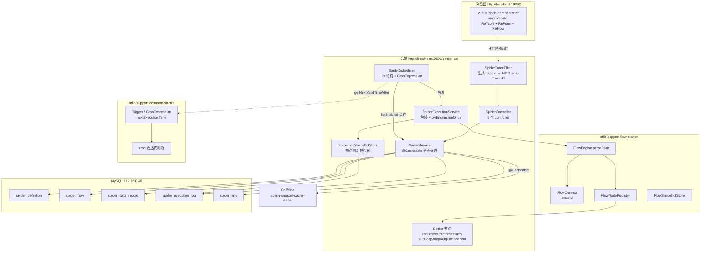
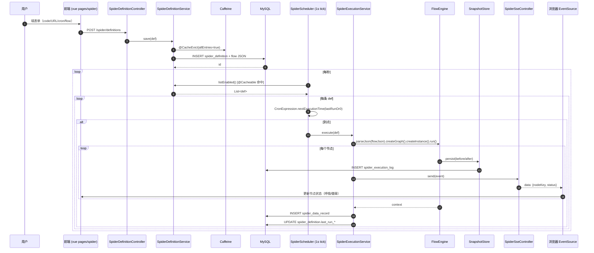
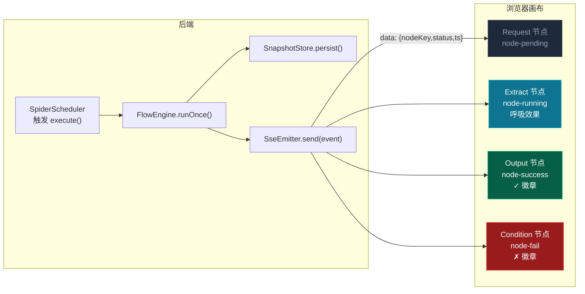
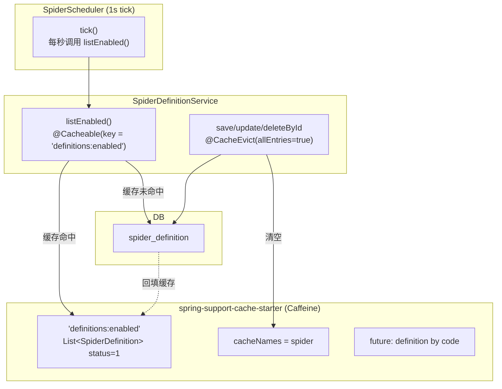
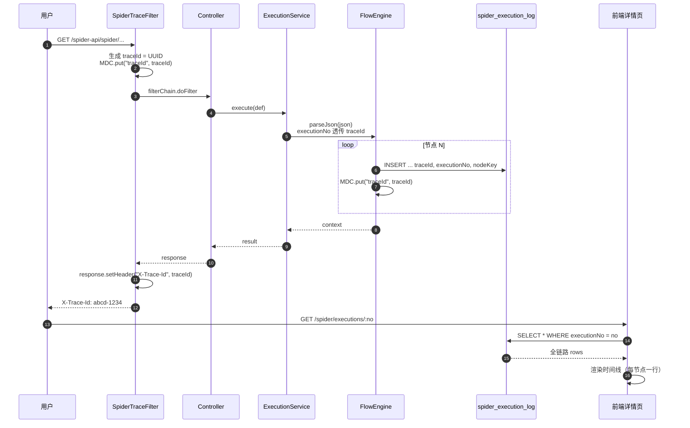

# 爬虫中心架构图

> 包含整体架构、模块依赖、数据流、SSE 实时链路、缓存策略的可视化说明。所有图用 Mermaid 语法，可在 GitHub/VSCode 渲染。

---

## 1. 整体架构



---

## 2. 数据流：用户新增一个爬虫 → 自动定时执行 → 数据入库



---

## 3. 节点类型与连线（DAG）

```mermaid
graph LR
  Start([start]) --> Req[spider.request<br/>URL/method/headers]
  Req --> Ext[spider.extract<br/>$.title → title]
  Req --> Cond{spider.condition<br/>status==200?}
  Cond -- yes --> Ext
  Cond -- no --> Skip[spider.transform<br/>空清洗]
  Ext --> Loop[spider.subLoop<br/>items[] as item]
  Loop --> Map[spider.map<br/>key 重命名]
  Map --> Out[spider.output<br/>写 spider_data_record]
  Skip --> Out
  Out --> End([end])

  classDef req fill:#3B82F6,stroke:#60A5FA,color:#fff
  classDef ext fill:#06B6D4,stroke:#67E8F9,color:#fff
  classDef out fill:#10B981,stroke:#34D399,color:#fff
  class Req req
  class Ext,Loop,Map,Skip ext
  class Out out
```

---

## 4. SSE 实时链路



---

## 5. 缓存策略



---

## 6. traceId 全链路追踪



---

## 7. 环境变量插值

```
spider_env 表里维护 BASE_URL=https://api.example.com
请求节点 url 配置：{{env.BASE_URL}}/users?page={{ctx.page}}
执行时：
  1. 解析 node props 字符串
  2. 替换 {{env.X}} → SELECT env_value FROM spider_env WHERE env_key = X
  3. 替换 {{ctx.X}} → currentFlowContext.get(X)
  4. 用替换后的字符串发请求
```

---

## 8. 包依赖关系

```mermaid
graph TB
  subgraph "spring-support-parent-starter"
    S1["spring-support-spider-starter (新)"]
    S2["spring-support-cache-starter"]
  end

  subgraph "utils-support-parent-starter"
    U1["utils-support-flow-starter (改造)"]
    U2["utils-support-common-starter"]
    U3["utils-support-mysql-starter"]
  end

  subgraph "vue-support-parent-starter"
    V1["pages/spider (新)"]
    V2["packages/ui/ReFlow (新)"]
  end

  S1 --> U1
  S1 --> U2
  S1 --> U3
  S1 --> S2
  V1 --> V2
  V2 -->|"@logicflow/core"| LogicFlow[(@logicflow/core)]
```

---

## 9. 部署视图

```
┌─────────────────────────────┐
│  MySQL 172.16.0.40:3306     │
│  root/root                  │
│  DB: spider (spider_xxx)    │
└────────────┬────────────────┘
             │ JDBC
             ▼
┌─────────────────────────────┐
│  spring-support-spider-     │
│  starter                    │
│  ├── port: 19091            │
│  ├── context-path: /spider-api │
│  └── 监听 1s 调度           │
└────────────┬────────────────┘
             │ HTTP/REST + SSE
             ▼
┌─────────────────────────────┐
│  Vite dev (端口 19092)      │
│  pages/spider               │
│  ReTable / ReForm / ReFlow  │
└─────────────────────────────┘
```

---

## 设计原则

- **复用优先**：不重写 flow 引擎、不重写 cron，组合现有能力
- **缓存写入**：高频读全表缓存，写时整清（allEntries=true）
- **节点注册式**：新节点 = 加一个类 + `@PostConstruct` 注册，不动引擎
- **traceId 贯穿**：从入口 filter 到 logback 到 DB 到前端详情
- **SSE 而非轮询**：浏览器订阅执行链路，状态变化即推送
- **暗色 + 图标化**：开发工具，dark mode first，禁用 emoji，所有图标 SVG
